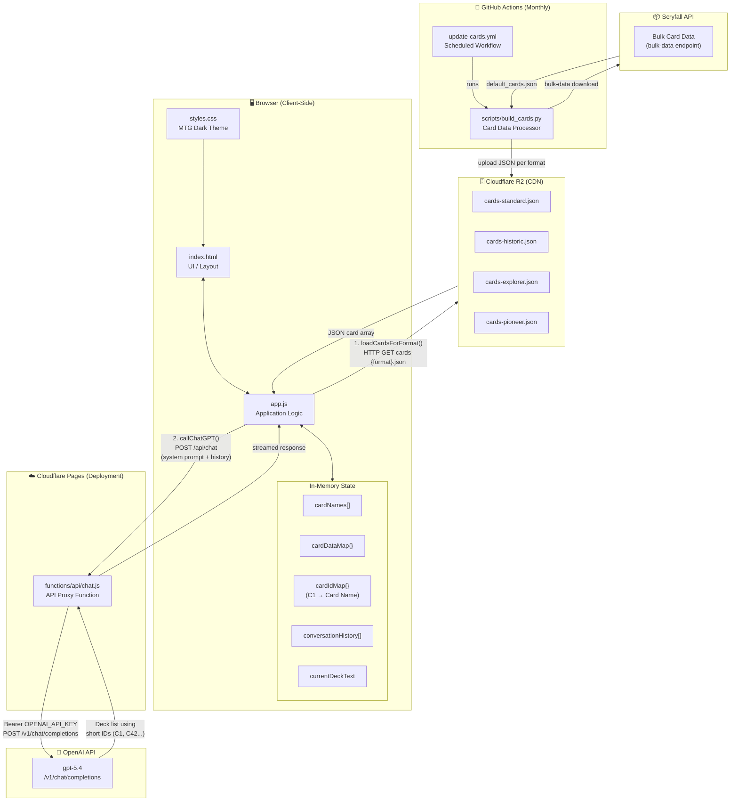
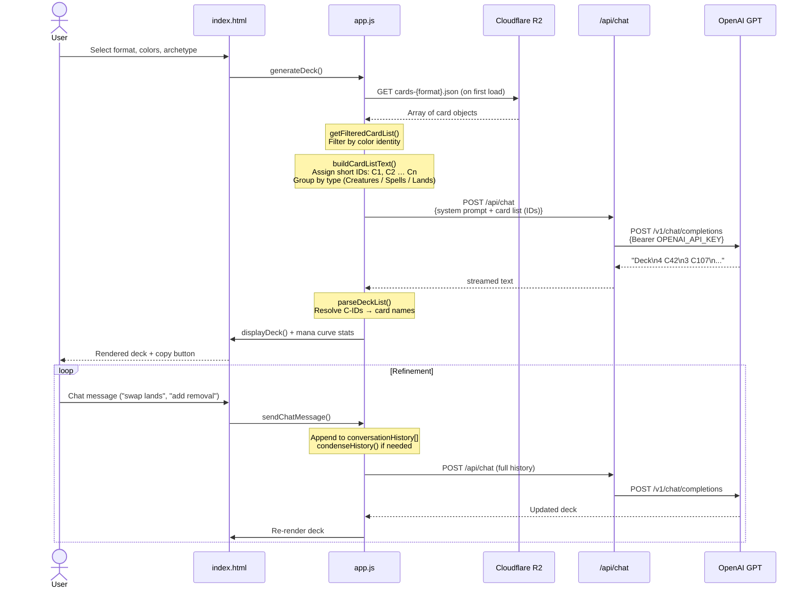

# MTG Deck Builder — Architecture Diagram

## System Overview

---

## Deck Generation Data Flow

---

## Component Responsibilities

| Component | Layer | Responsibility |
|-----------|-------|----------------|
| `index.html` | Frontend | UI layout, color pickers, deck output panels |
| `styles.css` | Frontend | MTG-themed dark styling, mana color variables |
| `app.js` | Frontend | State management, card filtering, prompt building, deck parsing, stats |
| `functions/api/chat.js` | Serverless (Cloudflare) | Proxy to OpenAI — hides API key from client |
| `scripts/build_cards.py` | Build / CI | Downloads Scryfall bulk data, filters by format legality, exports JSON to R2 |
| `.github/workflows/update-cards.yml` | CI/CD | Monthly automated card database refresh |
| Cloudflare R2 | Storage | CDN-hosted card JSON per format (Standard, Historic, Explorer, Pioneer) |
| OpenAI GPT-5.4 | External AI | Generates and refines deck lists using short card IDs |
| Scryfall API | External Data | Source of truth for legal card lists and metadata |

---

## Key Design Decisions

- **Serverless / stateless:** No backend database. All card data loaded into browser memory at startup.
- **Short ID compression:** Cards are mapped to IDs (`C1`–`Cn`) before being sent to the AI to minimize token usage on large card lists.
- **History condensing:** After a deck is generated, `condenseHistory()` replaces the verbose card list in the chat history with a compact deck summary, keeping subsequent turns cheap.
- **Cloudflare Pages Function as proxy:** The OpenAI API key never reaches the browser; all AI calls go through `/api/chat`.
- **Monthly CI refresh:** Card legality changes are automatically pulled from Scryfall and re-uploaded to R2 on the 1st of each month.
